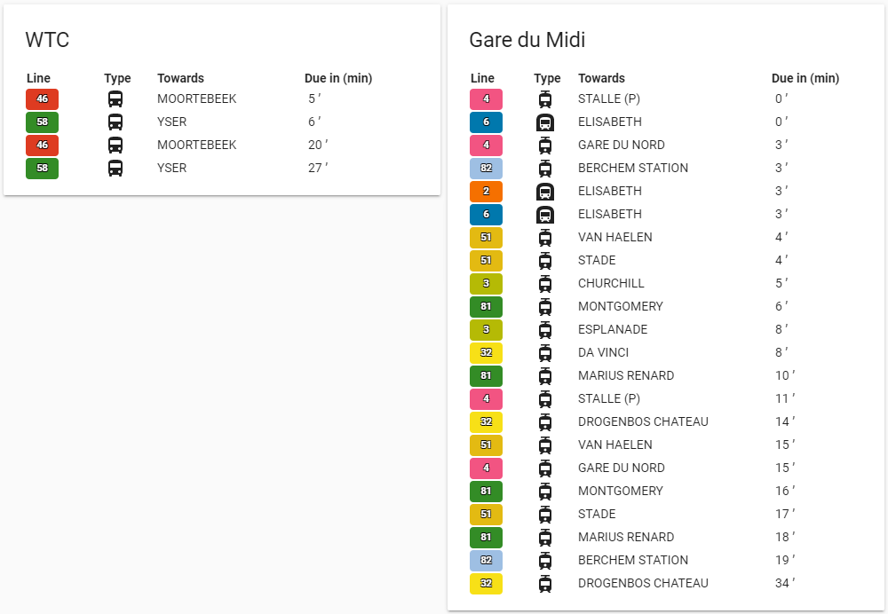

# stib-mvib-card

This card generates a passages card for the STIB/MVIB public transport service in Brussels (Belgium).



## Options TODO, not yet up to date

| Name | Type | Requirement | Description
| ---- | ---- | ------- | -----------
| type | string | **Required** | `custom:stib-mvib-card`
| entity | string | **Required** | The entity_id of the entity you want to show.
| title | string | **Optional** | Add a custom title to the card.
| config_type | string | **Optional** | 'default' for standard setup, 'raw' for raw entity data, 'columns' for defining a custom list of columns. If this option is not added the default setup will be shown in the card.
| columns | object | **Optional** | List of columns to display.

## Column object

| Name | Type | Requirement | Description
| ---- | ---- | ------- | -----------
| title | string | **Required** | Column header to display.
| field | string | **Required** | key value of the entity that you wish to display.

## Installation

### Step 1

Install `stib-mvib-card` by copying `stib-mvib-card.js` from this repo to `<config directory>/www/stib-mvib/stib-mvib-card.js` of your Home Assistant instance.

**Example:**

```bash
wget https://github.com/helldog136/stib-mvib-card/raw/master/stib-mvib-card.js
mv stib-mvib-card.js ~/.homeassistant/www/stib-mvib/
```

### Step 2

Set up the STIB/MVIB custom sensor.

**Example:**

```yaml
sensor:
  - platform: stib-mvib
    client_id: '<put your STIB API client_id here>'
    client_secret: '<put your STIB API client_secret here>'
    lang: 'fr'
    stops:
    - stop_name: 'Scherdemael'
      filtered_out_stop_ids:
      - 3733
      max_passages: 3
```
**_Note_**: replace with the correct API id/secret you generated with your opendata stib developer account.

### Step 3

Link `stib-mvib-card` inside you `ui-lovelace.yaml` or via the `Raw config editor` when using the `Configure UI` in the Home-Assistant interface directly.

```yaml
resources:
  - url: /local/stib-mvib/stib-mvib-card.js
    type: js
```

### Step 4

Add a custom element in your `ui-lovelace.yaml`. Or when using the `Configure UI` in the Home-Assistant interface directly you can add a `Manual Card` with this in the Card Configuration.

**Example:**

Example with default layout in the `ui-lovelace.yaml`:
```yaml
      - type: 'custom:stib-mvib-card'
        entity: sensor.scherdemael
        title: 'Scherdemael'

```
Same when going via the `Configure UI`:
```yaml
entity: sensor.scherdemael
title: 'Scherdemael'
type: 'custom:stib-mvib-card'


```


## Credits

This card is adapted from the code of https://github.com/DaGolle/delijn-card/blob/master/delijn-card.js, Kudos to him!